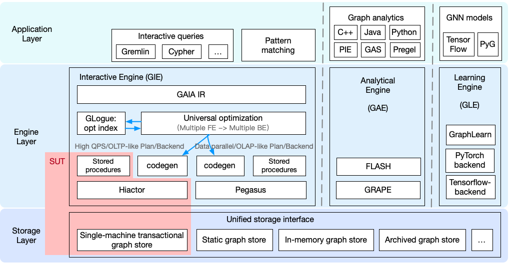

# GraphScope Flex for LDBC SNB Interactive (SUT) Manual

## 1. Introduction
Real-life graph applications exhibit a remarkable diversity and complexity. These applications cover various types of workloads, including graph analytics, interactive graph queries, graph pattern matching, and Graph Neural Networks (GNN). The organization and storage of graph data also present several options: should it be on-disk or in-memory, mutable or immutable, distributed, or transactional? A plethora of programming interfaces such as GQL, Cypher, Gremlin, Pregel, Gather-Scatter, GraphBLAS, and PIE, are available for users to write queries or algorithms. The decision extends to deployment modes and performance requirements too. Is it more appropriate to use the application as a graph computing task in an offline data analytical pipeline, or should it serve as an online service? Should the focus be on accommodating a higher query volume or ensuring lower query latency?

In response to the inherent diversity and complexity of graph applications, we're actively developing [GraphScope Flex](https://github.com/alibaba/GraphScope/tree/main/flex), a continual evolution of [GraphScope](https://github.com/alibaba/GraphScope). It promotes a modular design that minimizes resource and cost requirements while simultaneously offering a seamless, user-friendly interface for flexible deployment. Currently, GraphScope Flex is in its technical preview stage. The Software Under Test (SUT) has been constructed and released alongside the `0.23.0` version of GraphScope.

<h1 align="center">
    
</h1>
<p align="center">
    The architecture of GraphScope and the SUT for LDBC SNB Interactive.
</p>

To support LDBC SNB Interactive benchmark, we build the SUT as follows (marked in the red box in the figure above).

- [Queries](https://github.com/GraphScope/flex_ldbc_snb/tree/main/stored_procedures): all interactive queries specified in the SNB benchmark as stored procedures written in C++.
- [Engine](https://github.com/alibaba/GraphScope/tree/v0.23.0/flex/engines/graph_db): the high QPS engine based on [Hiactor](https://github.com/alibaba/hiactor) from the GraphScope Flex for query execution.
- [Graph store](https://github.com/alibaba/GraphScope/tree/v0.23.0/flex/storages/rt_mutable_graph): an internal proprietary single-machine transactional graph store.
* Other unused components such as query language front ends (Gremlin, Cypher), the compiler, query optimization, code generator and data-parallel executor Pegasus in GIE are excluded from the SUT.

## 2. Installation

### 2.1 Preparation

This benchmark used two rd5.12xlarge instances, one for the driver and one for the SUT placed in a AWS Placement group with the cluster strategy to reduce network latency. Both machines were assigned to the same VPC with the same subnet.

The operating system we use is ubuntu 20.04 server. Running `./scripts/install_dependencies.sh` will install dependencies.

We also provide an AWS AMI with dependencies pre-installed.

```
AMI id: ami-00ad1b9bbd056554b
AMI name: rt_server
Instance type: r5d.12xlarge
```

Note: A http server will be started on a specified port (10000 as default) of the SUT node. Please check the inbound rules of security groups used by AWS instances to make sure that the SUT is reachable with http requests from the driver node.


### 2.2 Install the SUT

```shell
# Install GraphScope Flex as a db-like service with hiactor, stored procedure support and mcsr storage backend.
wget https://github.com/alibaba/GraphScope/releases/download/v0.23.0/graphscope_flex_db_hiactor_cppsp_mcsr_0.23.0_amd64.deb
dpkg -i graphscope_flex_db_hiactor_cppsp_mcsr_0.23.0_amd64.deb 
```

The installed files are:

```shell
├── bin
│   ├── flex_analytical_engine
│   ├── rt_admin
│   └── rt_server
├── include
│   └── flex
│       ├── engines
│       │   └── graph_db
│       │       ├── app
│       │       │   ├── app_base.h
│       │       │   └── app_utils.h
│       │       └── database
│       │           ├── graph_db.h
│       │           ├── graph_db_session.h
│       │           ├── insert_transaction.h
│       │           ├── read_transaction.h
│       │           ├── single_edge_insert_transaction.h
│       │           ├── single_vertex_insert_transaction.h
│       │           ├── update_transaction.h
│       │           └── version_manager.h
│       ├── storages
│       │   └── rt_mutable_graph
│       │       ├── mutable_csr.h
│       │       ├── mutable_property_fragment.h
│       │       ├── schema.h
│       │       └── types.h
│       └── utils
│           ├── allocators.h
│           ├── id_indexer.h
│           ├── mmap_array.h
│           ├── property
│           │   ├── column.h
│           │   ├── table.h
│           │   └── types.h
│           └── string_view_vector.h
└── lib
    ├── libflex_bsp.so
    ├── libflex_graph_db.so
    ├── libflex_immutable_graph.so
    ├── libflex_rt_mutable_graph.so
    └── libflex_utils.so
```

### 2.3 Build LDBC Driver

The version of LDBC driver is 1.2.0. To compile the driver, run:

```
cd driver
mvn clean package -DskipTests
```

## 3. SUT Usage

Here are some instructions to start/interact with SUT.

### 3.1 SUT Server

To start the SUT server, run:

```
rt_server -g /path/to/schema_config -d /path/to/data [-l /path/to/load_schema] [-s n]
```

- `-d` Specifies the work directory, snapshots and write-ahead log will be generated here.
    - If the work directory is empty, the query engine will load graph defined by the input description file, and generate an initial snapshot in work directory.
    - Otherwise, the query engine will recover by loading the initial snapshot and replaying update operations.
- `-g` Specifies the schema description file.
    - `configs/graph.yaml` is an example of schema description file.
- `-l` Specifies the bulk loading description file.
    - `configs/bulk_load.yaml` is an example of bulk loading description file, it defines the path of raw files and the mapping from raw files to vertex/edge labels.
- `-s` Specifies the concurrency.

Recovering from an existing work directory and then bulk loading from raw files is not supported. When the specified work directory is recoverable and the bulk loading description file is provided, the bulk loading will be ignored.


### 3.2 `rt_admin`

`rt_admin` is a tool for managing stored procedures and inspecting graph data. The corresponding `rt_admin` service can be configured with environment variables `GRAPHSCOPE_IP` and `GRAPHSCOPE_PORT`. It currently supports five types of operations.

```
rt_admin <operation> <args...>
```

- Show all registered stored procedures:

```
rt_admin show_stored_procedures
```

- Query vertex by providing label and id:

```
rt_admin query_vertex <LABEL> <ID>
```

- Query edges by providing labels and ids:

```
rt_admin query_edge <SRC-LABEL> <SRC-ID> <DST-LABEL> <DST-ID> <EDGE-LABEL>
```

Labels can be specified as `_ANY_LABEL` and ids can be specified as `_ANY_ID` to query a set of edges.


## 4. Preprocessing

### 4.1 Dataset Generation

We use the [Hadoop-based Datagen's](https://github.com/ldbc/ldbc_snb_datagen_hadoop) CsvComposite serializer classes (with the default date formatter).
The Datagen configurations for SF10, SF30, SF100 and SF300 are `configs/params-sf10.ini`, `configs/params-sf30.ini`, `configs/params-sf100.ini`, and `configs/params-sf300.ini`. An example of `params.ini` (sf10):

```
ldbc.snb.datagen.generator.scaleFactor:snb.interactive.10
ldbc.snb.datagen.serializer.numUpdatePartitions:32

ldbc.snb.datagen.serializer.dynamicActivitySerializer:ldbc.snb.datagen.serializer.snb.csv.dynamicserializer.activity.CsvCompositeDynamicActivitySerializer
ldbc.snb.datagen.serializer.dynamicPersonSerializer:ldbc.snb.datagen.serializer.snb.csv.dynamicserializer.person.CsvCompositeDynamicPersonSerializer
ldbc.snb.datagen.serializer.staticSerializer:ldbc.snb.datagen.serializer.snb.csv.staticserializer.CsvCompositeStaticSerializer
```

To generate datasets in server machine for LDBC SNB benchmark:

- **Step 1**: Download `ldbc_snb_datagen_hadoop`:

```shell
# env: ubuntu 20.04
apt update
apt install git maven python -y
git clone https://github.com/ldbc/ldbc_snb_datagen_hadoop.git
cd ldbc_snb_datagen_hadoop
git checkout v0.3.6
```
- **Step 2**: Install&Config Hadoop.

```shell
wget https://archive.apache.org/dist/hadoop/core/hadoop-3.2.1/hadoop-3.2.1.tar.gz
tar xf hadoop-3.2.1.tar.gz
export HADOOP_CLIENT_OPTS="-Xmx2G"
export HADOOP_HOME=`pwd`/hadoop-3.2.1
export JAVA_HOME="/usr"
```

- **Step 3**: Run the script:

```shell
./run.sh
```

The example output directory is:

```shell
ldbc_snb_datagen_hadoop/
├── social_network
└── substitution_parameters
```

### 4.2 Build Stored Procedures for LDBC Interactive Queries

In the server machine, go to the root directory then run:

```shell
cd stored_procedures
./build.sh
```

### 4.3 Config a rt_server Server

Before starting a rt_server server, two config files need to be set to indicate the correct paths to graph
data and stored procedures. 
- Edit the config file of `configs/graph.yaml`, set the correct (absolute) paths of stored procedures.
- Edit the config file of `configs/bulk_load.yaml`, set the correct (absolute) paths of raw data files.

## 5. LDBC SNB Interactive benchmark

### 5.1 Run Benchmark

- Benchmark properties:
  - sf30: `./driver/graphscope/driver/benchmark.properties`, tcr is set as 0.00112.
  - sf100: `./driver/graphscope/driver/benchmark-sf100.properties`, tcr is set as 0.0039.
  - sf300: `./driver/graphscope/driver/benchmark-sf300.properties`, tcr is set as 0.014.

- **Step 1**: Start a `rt_server` server in server machine. (See [Server](#31-sut-server) for more details) run command:

``` shell
nohup rt_server -g /path/to/schema_config -d /path/to/data [-l /path/to/load_config] -s 48 &
```

- **Step 2**: After the graph(sf30/sf100/sf300) is loaded (when log 'GraphScope http server start to listen on port XXXXX' printed), run the driver in the driver machine.

```
./graphscope/driver/benchmark.sh
```

### 5.2 Create Validation
- **Step 0**: TigerGraph require `LongDateFormat`, which is not consistent with the datasets we generated in the previous steps.
```
ldbc.snb.datagen.generator.scaleFactor:snb.interactive.10
ldbc.snb.datagen.serializer.dateFormatter:ldbc.snb.datagen.util.formatter.LongDateFormatter
ldbc.snb.datagen.serializer.dynamicActivitySerializer:ldbc.snb.datagen.serializer.snb.csv.dynamicserializer.activity.CsvCompositeDynamicActivitySerializer
ldbc.snb.datagen.serializer.dynamicPersonSerializer:ldbc.snb.datagen.serializer.snb.csv.dynamicserializer.person.CsvCompositeDynamicPersonSerializer
ldbc.snb.datagen.serializer.staticSerializer:ldbc.snb.datagen.serializer.snb.csv.staticserializer.CsvCompositeStaticSerializer
```
We need to re-generate sf-10 datasets for TigerGraph.

- **Step 1**: We use TigerGraph to generate the validation data for sf10. `configs/params-sf10-tigergraph.ini` will be used to generate graph data.

```shell
git clone https://github.com/ldbc/ldbc_snb_interactive_impls.git
cd ldbc_snb_interactive_impls
git checkout v1.1.0
mvn package -DskipTests -Ptigergraph -U
cd tigergraph
export TIGERGRAPH_DATA_DIR=${PATH_TO_DATASET}
./scripts/load-in-one-step.sh
```

- **Step 2**: Revise the TigerGraph. The implementation of IC3 (`queries/interactiveComplex3.gsql`) in TigerGraph need to be revised. The results should be sorted with 'count' instead of 'countX'.

```
CREATE OR REPLACE QUERY interactiveComplex3(VERTEX<Person> personId, STRING countryXName, STRING countryYName, INT startDate, INT durationDays) SYNTAX v2 {
  TYPEDEF TUPLE<INT personId, STRING personFirstName, STRING personLastName, INT xCount, INT yCount, INT xyCount> msgStats;
  HeapAccum<msgStats>(20, xyCount DESC, personId ASC) @@result;
  SumAccum<UINT> @xCount, @yCount;
  MaxAccum<UINT> @@countryId1, @@countryId2;
  OrAccum<BOOL> @selected, @selected2;
  INT endDate;
  endDate = startDate + durationDays * 24*60*60*1000; # number of milliseconds in a day
  S = { personId };
  P = SELECT p FROM S:s -(KNOWS*1..2)- Person:p WHERE p != personId;
  country1 = SELECT cn
     FROM Country:cn -(<IS_PART_OF)- City:c
    WHERE cn.name == countryXName
     ACCUM c.@selected += true
     POST-ACCUM @@countryId1 += cn.id;
  country2 = SELECT cn
     FROM Country:cn -(<IS_PART_OF)- City:c
     WHERE cn.name == countryYName
     ACCUM c.@selected += true
     POST-ACCUM @@countryId2 += cn.id;
  P = SELECT p FROM P:p -(IS_LOCATED_IN>)- City:c WHERE NOT c.@selected;
    P = SELECT p
    FROM P:p -(<HAS_CREATOR)- (Post|Comment):m
    WHERE m.creationDate between startDate AND endDate
    ACCUM
      IF m.countryId == @@countryId1 THEN p.@xCount += 1 END,
      IF m.countryId == @@countryId2 THEN p.@yCount += 1 END
    HAVING p.@xCount > 0 AND p.@yCount > 0;
  P = SELECT p
    FROM P:p
    ACCUM @@result += msgStats(p.id, p.firstName, p.lastName, p.@xCount, p.@yCount, (p.@xCount + p.@yCount));
  PRINT @@result as result;
}
```

- **Step 3**: Setup parameters in `driver/create-validation-parameters.properties`, and then:

```shell
driver/create-validation-parameters.sh
```

File `validation_params.csv` will be generated in current directory.

### 5.3 Validation Test

- **Step 1**: Start the server:

``` shell
nohup rt_server -g /path/to/config -d /path/to/data &
```

- **Step 2**: Make sure `./driver/graphscope/validation_params.csv` exists, after the graph (sf10) is loaded.

```
cd ./driver/graphscope
./driver/validate.sh
```

## 6. ACID Tests

### 6.1 Atomicity and Isolation Tests

Atomicity and isolation tests are implemented in `./tests/test_acid.cc`.

```shell
cd ./tests
./build.sh
./test_acid
```

### 6.2 Recovery and Durability

- **Step 1**: Start the service on sf30 graph (see [Benchmark](#51-run-benchmark)).
- **Step 2**: Start the driver.
- **Step 3**: Shutdown in 2 hours.

```
sudo shutdown -rf +120
```

- **Step 4**: Take a break, wait 2 hours.
- **Step 5**: After rebooting the server machine, restart the service on same work directory using the same instruction in step 1.
- **Step 6**: The script `./scripts/test_recovery.sh` will parse the result log to get the last INS* queries before shutting down, and query them from the restarted service. Edit the `GRAPHSCOPE_IP` and `GRAPHSCOPE_PORT` before running command:

```
./scripts/test_recovery.sh ./driver/graphscope/results/LDBC-SNB-results_log.csv /path/to/graph/data/social_network
```

### 6.3 Consistency

The SUT does not maintain extra indices or precomputed values, thus there is no consistency concern.
